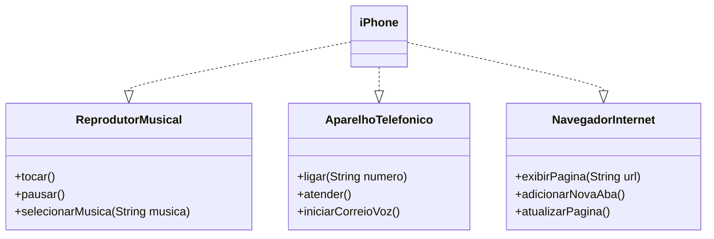

# 📱 iPhone UML e Implementação em Java

Este projeto foi desenvolvido como parte de um desafio de modelagem orientado à objetos, com base no lançamento original do iPhone em 2007. O objetivo é representar, via UML e código Java, as funcionalidades do iPhone como **Reprodutor Musical**, **Aparelho Telefônico** e **Navegador de Internet**.

---

## 📌 Funcionalidades Modeladas

- 🎵 **Reprodutor Musical**
  - `tocar()`
  - `pausar()`
  - `selecionarMusica(String musica)`

- 📞 **Aparelho Telefônico**
  - `ligar(String numero)`
  - `atender()`
  - `iniciarCorreioVoz()`

- 🌐 **Navegador na Internet**
  - `exibirPagina(String url)`
  - `adicionarNovaAba()`
  - `atualizarPagina()`

---

## 📐 Diagrama UML



---

## 📁 Estrutura do Projeto

```
/src
├── Main.java
├── iPhone.java
├── ReprodutorMusical.java
├── AparelhoTelefonico.java
└── NavegadorInternet.java
```

---

## 🧪 Como Executar

1. Clone o repositório:
   ```bash
   git clone https://github.com/seu-usuario/iphone-uml-java.git
   cd iphone-uml-java/src
   ```

2. Compile os arquivos:
   ```bash
   javac *.java
   ```

3. Execute o programa:
   ```bash
   java Main
   ```

---

## 🖥️ Menu Interativo

Ao rodar o programa, será exibido um menu onde você pode:

```
====== MENU DO IPHONE ======
1. Tocar música
2. Pausar música
3. Selecionar música
4. Ligar para um número
5. Atender ligação
6. Iniciar correio de voz
7. Exibir página na internet
8. Adicionar nova aba
9. Atualizar página
0. Sair
```

---

## ✅ Requisitos

- Java 8 ou superior
- Terminal ou IDE de sua preferência

---

## 📚 Referência

- [Lançamento original do iPhone (2007)](https://www.youtube.com/watch?v=9hUIxyE2Ns8)

---

## 🧠 Autor

Desenvolvido como parte do desafio de modelagem UML da plataforma DIO.
